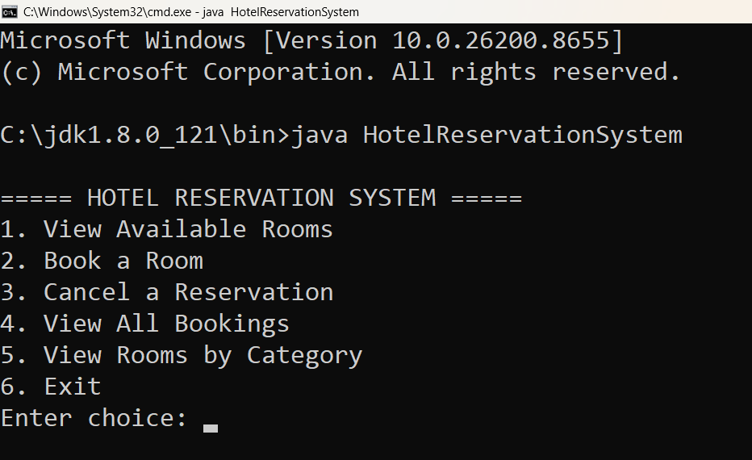

# Hotel Reservation System

## Overview

The Hotel Reservation System is a Java console-based application designed to manage hotel room bookings efficiently. It allows users to view available rooms, make reservations, cancel bookings, manage customer records, and simulate payment processing.

## Features

* View Available Rooms
* Book a Room
* Cancel Reservations
* View All Bookings
* Filter Rooms by Category
* Payment Simulation
* File Handling using CSV Files
* Persistent Data Storage
* Booking Receipt Generation

## Technologies Used

* Java
* Object-Oriented Programming (OOP)
* File Handling
* ArrayList
* CSV Storage

## Project Structure

* HotelReservationSystem.java
* rooms.csv
* bookings.csv

## How to Run

### Compile

javac HotelReservationSystem.java

### Execute

java HotelReservationSystem

## Screenshots

### Main Menu

### Available Rooms

### Book Room

### Booking Receipt

### All Bookings

### Cancel Reservation

## Learning Outcomes

This project helped in understanding:

* Java Programming
* Object-Oriented Programming
* File Handling
* Data Persistence
* Menu Driven Applications
* Real-world Booking Systems

## Author

Prasit Bankar
